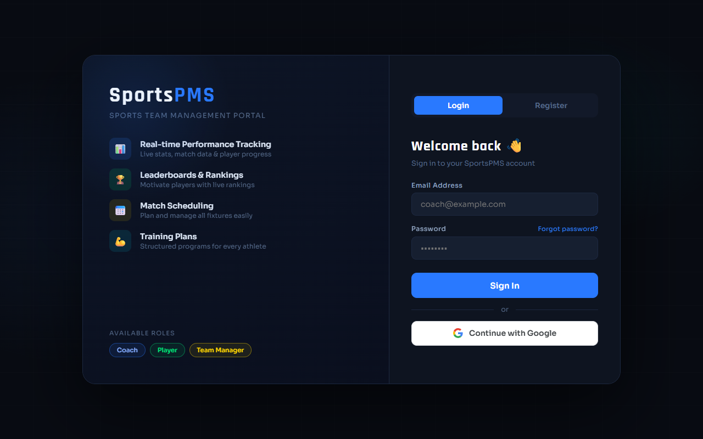

<div align="center">

# 🏀 CoachHub


A full-featured Sports Team Management Portal for Coaches, Players, and Team Managers.

</div>

---

## 🌐 Live Demo
Check out the live deployed application here: **[Live Demo on Vercel](https://coachhubdemo.vercel.app/)**



## 🏆 Features Overview

| Role | Capabilities |
|---|---|
| **Coach** | Create a team code, add matches, set training plans, post announcements, update player stats. |
| **Player** | Join a team via code, view personal stats, match schedules, leaderboards, and training plans. |
| **Manager** | View overall team statistics, monitor all players and coaches, and access comprehensive match reports. |

---

## 🛠 Tech Stack

- **Frontend**: HTML5, CSS3, Vanilla JavaScript
- **Backend/Database**: Firebase Firestore
- **Authentication**: Firebase Authentication
- **Hosting**: GitHub Pages / Vercel

---

## 📁 Project Structure

```text
coachhub/
├── index.html                  # Unified Login & Register page
├── dashboard-coach.html        # Coach Dashboard
├── dashboard-player.html       # Player Dashboard
├── dashboard-manager.html      # Manager Dashboard
├── css/
│   └── style.css               # Global application styles
├── js/
│   ├── firebase-config.js      # Firebase Initialization
│   ├── auth.js                 # Authentication logic
│   └── db.js                   # Firestore data helpers
├── preview.png                 # Application screenshot
└── README.md                   # Project documentation
```

---

## 🚀 Installation & Setup

1. **Clone the repository:**
   ```bash
   git clone https://github.com/dharani2006lakshmi-sys/coachhub.git
   cd coachhub
   ```

2. **Configure Firebase:**
   - Create a project in [Firebase Console](https://console.firebase.google.com/).
   - Enable **Authentication** (Email/Password) and **Firestore**.
   - Open `js/firebase-config.js` and paste your Firebase Web API config.

3. **Run Locally:**
   Simply open `index.html` in your web browser or use a tool like VS Code Live Server!

---

## 🔐 Firestore Security Rules

Ensure your database is protected by applying these rules in your Firebase Console:

```javascript
rules_version = '2';
service cloud.firestore {
  match /databases/{database}/documents {
    match /users/{userId} { allow read, write: if request.auth != null && request.auth.uid == userId; }
    match /players/{playerId} { allow read, write: if request.auth != null; }
    match /matches/{id} { allow read, write: if request.auth != null; }
    match /training/{id} { allow read, write: if request.auth != null; }
    match /announcements/{id} { allow read, write: if request.auth != null; }
    match /coaches/{id} { allow read, write: if request.auth != null; }
    match /managers/{id} { allow read, write: if request.auth != null; }
  }
}
```
